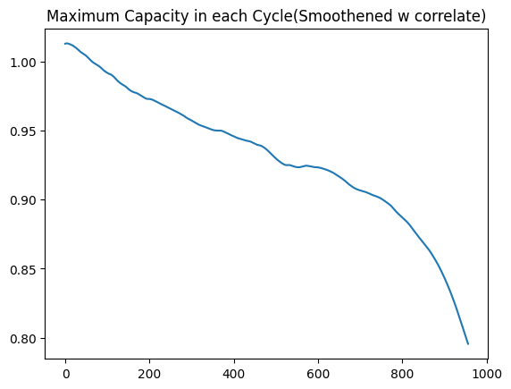
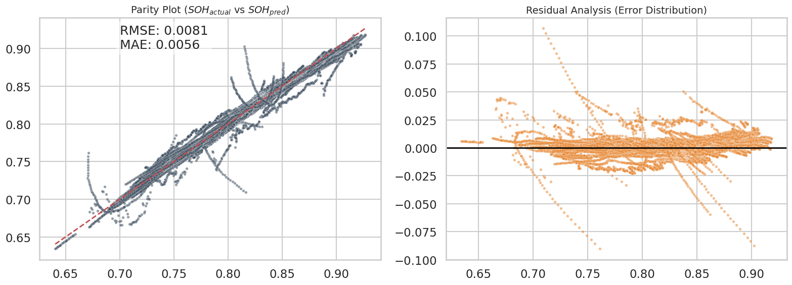
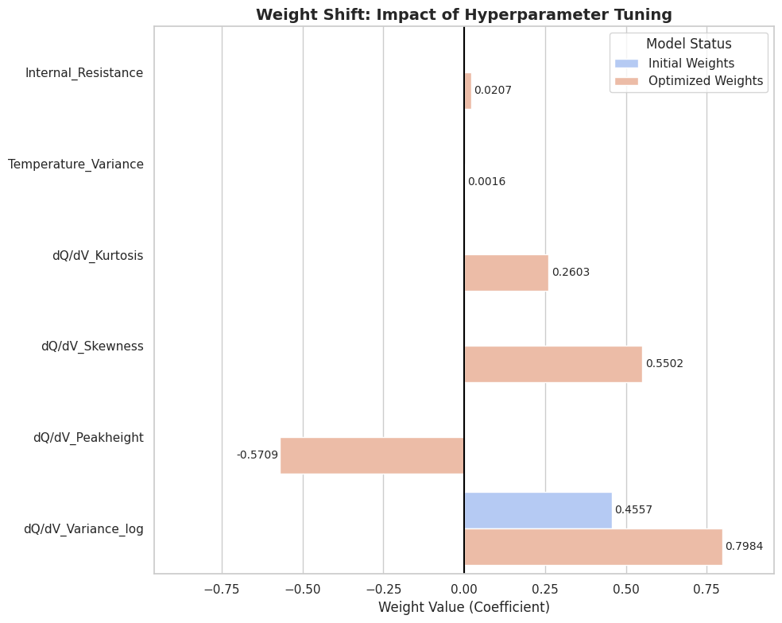
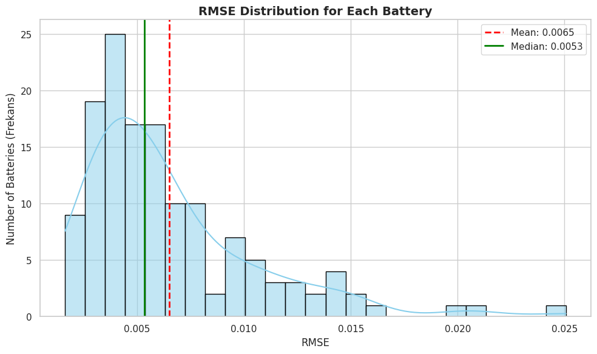
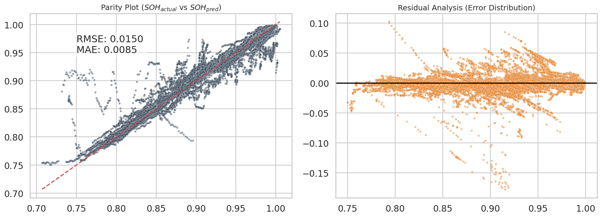
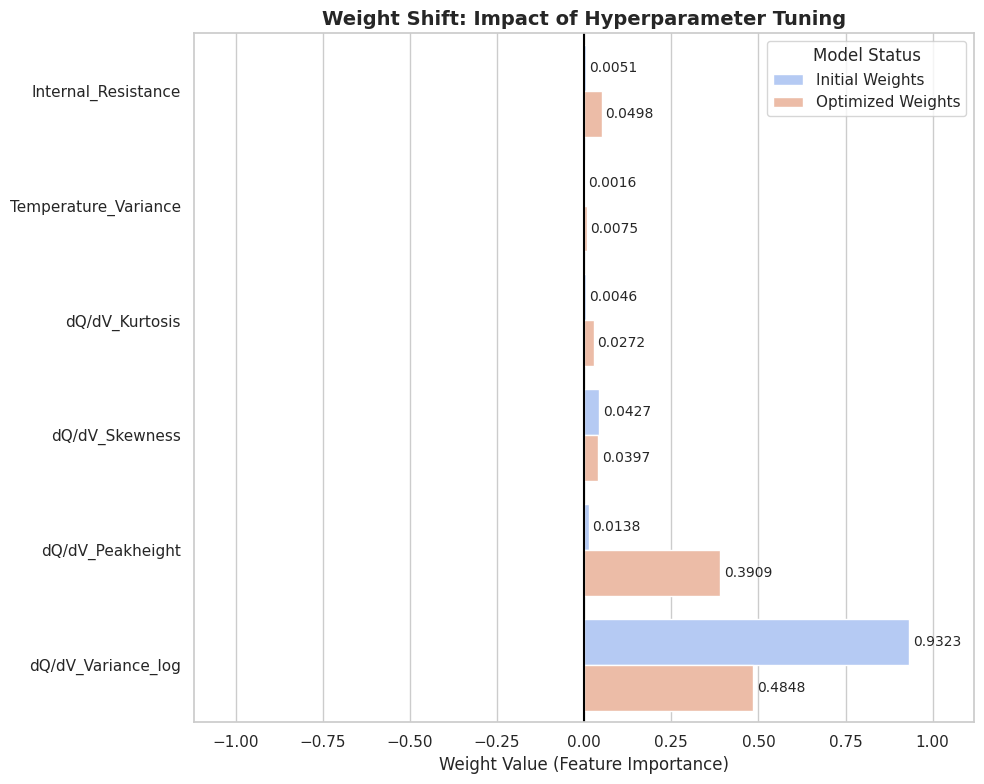
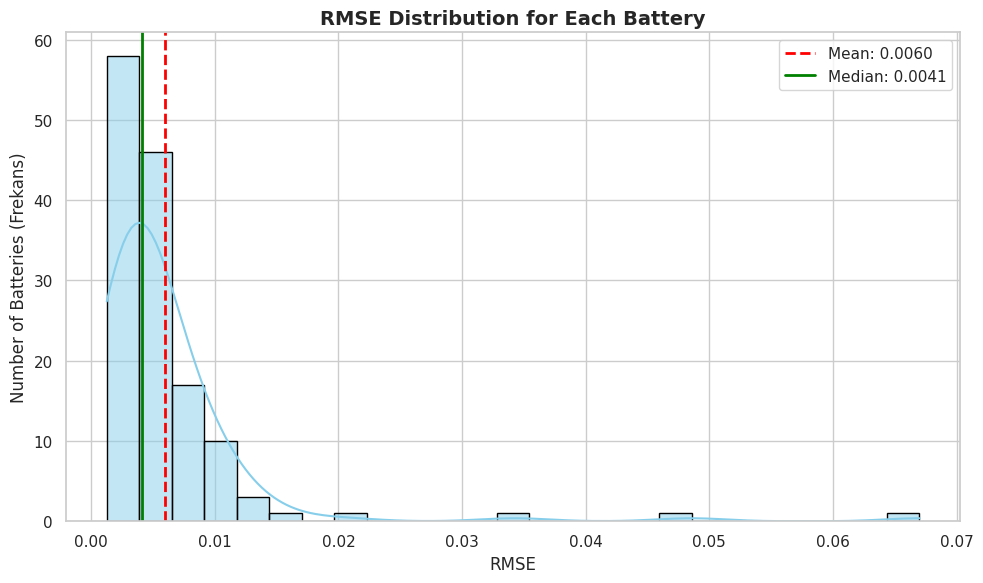

# TRI Battery Aging & SoH Prediction 

**Dataset**: Toyota Research Institute (TRI) fast-charging LFP battery aging dataset
Available at: https://data.matr.io/1/projects/5c48dd2bc625d700019f3204  
Original publication: [^1]
(**Note:** FastCharge_000002_CH26_structure.json wasn't used in analysis because of the lack of useful data in the file)

Jupyter Notebook project for **State of Health (SoH)** prediction using this dataset.  
ITU Mathematical Engineering – Spring 2026 term project.

## Project Goal
Using the open TRI battery aging dataset, I built models to predict battery State of Health (SoH / capacity fade) based on cycle data.

## Deployment & Tools
This project was developed with **generative AI assistance** for code structuring suggestions, debugging ideas, and writing clean documentation. All scientific implementation, data processing pipelines, model training and analysis were performed by me.

**Note:** This project was originally submitted as a **MATLAB** assignment. This semester I completely rewrote it from scratch in **Python** on my own: added proper JSON → HDF5 conversion, Savitzky-Golay smoothing, feature preparation, and trained ElasticNet + Random Forest models. This allowed me to switch tools and significantly improve the quality and reproducibility of the work.


## Notebooks
| # | File                                      | Description                                                                 |
|---|-------------------------------------------|-----------------------------------------------------------------------------|
| 1 | `01_Data_Exploration.ipynb`               | Data loading, EDA, visualizations, Savitzky-Golay window optimization |
| 2 | `02_JSON_to_H5_Decoder.ipynb`             | Parse JSON files, extract `cycles_interpolated`, save into unified `.h5` |
| 3 | `03_Features_Target_Matrices.ipynb`       | Load, clean, smooth (Savitzky-Golay), prepare matrices, save ready `.h5` |
| 4 | `04_Model_Training_ElasticNet_RF.ipynb`   | Train ElasticNet & Random Forest, predict, evaluate & visualize results |
| 5 | `05_Model_Training_XGBoost_LightGBM.ipynb`| Train XGBoost & LightGBM models, hyperparameter tuning, evaluation & comparison |


## Environment
Python 3.8+ recommended  
Dependencies listed in `requirements.txt` (includes numpy, pandas, scipy, scikit-learn, h5py, matplotlib, seaborn)
(**Note:** Python 3.12.3 has been used in a virtual environment for this project)


## How to Run
- Click to the matr.io link mentioned above to reach the dataset page
- Scroll down in the page
- Download dataset from the link named as "BEEP structured data"
- Access notebooks from colab links or code bellow **(Order: 1 -> 2 -> 3 -> 4)**

[](https://colab.research.google.com/github/yasin6n/TRI-Battery-SOH-Prediction/blob/main/01_Data_Exploration.ipynb)  

[](https://colab.research.google.com/github/yasin6n/TRI-Battery-SOH-Prediction/blob/main/02_JSON_to_H5_Decoder.ipynb)  

[](https://colab.research.google.com/github/yasin6n/TRI-Battery-SOH-Prediction/blob/main/03_Features_Target_Matrices.ipynb)  

[](https://colab.research.google.com/github/yasin6n/TRI-Battery-SOH-Prediction/blob/main/04_Model_Training_ElasticNet_RF.ipynb)

[](https://colab.research.google.com/github/yasin6n/TRI-Battery-SOH-Prediction/blob/main/05_Model_Training_XGBoost_LightGBM.ipynb)

**Locally:**
```bash
git clone https://github.com/yasin6n/TRI-Battery-SOH-Prediction.git
cd TRI-Battery-SOH-Prediction
pip install -r requirements.txt
jupyter notebook
```

## Key Results
- Achieved competitive RMSE/MAE on cycle-life prediction using ElasticNet and Random Forest models
- Demonstrated clear feature importance (e.g., via coefficients and importances)
- Showed improvement after hyperparameter tuning and proper smoothing
- Prevented data leakage with causal Savitzky-Golay filtering (past data only)
- **Update (March 31, 2026):** Achieved even better RMSE/MAE with XGBoost (Extreme Gradient Boosting) and LightGBM (Light Gradient Boosting Machine) models
- Total approximate time spent (training + optimization + testing) for;
  - **ElasticNet**: 12 Seconds
  - **Random Forest**: 7.5 Minutes
  - **XGBoost**: 3 Minutes
  - **LightGBM**: 2.5 Minutes

**Important Update (28 March 2026):**  
SOH calculation has been revised by using the **nominal capacity (1.1 Ah)** provided by the dataset creators, instead of the initial capacity. This change approximately **doubled the model's predictive performance** and nearly **halved the error rates**.

**Minor Update (March 31, 2026):**

In the data smoothing stage, the `polyorder` value of the causal (past-dependent) Savitzky-Golay filter is reduced from **2 to 1**. This simple change reduced over-smoothing and slightly improved the model performance.

**New results (current best values):**

**Update (March 31, 2026):** XGBoost & LightGBM trained in `05_Model_Training_XGBoost_LightGBM.ipynb` → **0.0059 RMSE / 0.0034 MAE** (new best, outperforms all previous models).

| Model             | RMSE        | MAE           |
|-------------------|-------------|---------------|
| **Elastic Net**   | **0.0077**  | **0.0055**    |
| **Random Forest** | **0.0064**  | **0.0038**    |
| **XGBoost**       | **0.0059**  | **0.0034**    |
| **LightGBM**      | **0.0059**  | **0.0034**    |

*(Previous values: Elastic Net 0.0085/0.0058, Random Forest 0.0070/0.0041)*

### Previous Results (Initial Capacity - Reference Only)
> These results used a different SOH definition and should **not** be directly compared with the current ones.

- **Elastic Net**: RMSE ≈ 0.0154 (1.54%), MAE ≈ 0.0099 (0.99%)
- **Random Forest**: RMSE ≈ 0.0141 (1.41%), MAE ≈ 0.0089 (0.89%)


## Visual Highlights

 
*Capacity degradation over cycles for sample batteries*


*Scatter and Residual plot showing prediction errors for Elastic Net


*Top features from Elastic Net model before/after optimization


*Histogram showing unique battery scores for Elastic Net*


*Scatter and Residual plot showing prediction errors for Random Forest
  
 
*Top features from Random Forest model before/after optimization


*Histogram showing unique battery scores for Random Forest*


## Key Skills & Takeaways
- Matlab to Python transition
- Using **os** library to find the path for the json files
- Using **json** library to decode json files
- Plotting graphs with **matplotlib** and **seaborn** libraries
- Inspecting the data better and extracting more features
- Using **numpy** library to do calculations and matrix operations
- Achieving lower ram usage by using **del** command and **gc** library
- Using **h5** file with **h5py** library to save memory space and have faster data pipeline
- Using **tqdm** library to follow progress on a bar while running the code
- Using **scipy** library for preprocessing the data
- Smoothing data with **Savitzky-Golay (savgol) filter**
- Defining the savgol filter such that it only uses past data to prevent data leakage
- Setting the **windowsize** better to achieve reduced noise in data and better analysis
- Using **sklearn(Scikit-Learn)** to make data ready for analysis, define regression models and calculate the error rates
- Doing **Cross-Validation** by splitting the data with **Group K-fold** method for 5 different Train-Test configurations
- Defining **Elastic Net** and **Random Forest** regressors to analyze the data and make predictions
- Using **MinMaxScaler** to normalize and **SimpleImputer** to replace NaN values in training data
- Inspecting the **weights** for each feature by checking **coefficients** in Elastic Net, and **feature importances** in Random Forest
- Optimizing the models by changing their **hyperparameters** with the usage of **GridSearchCV**
- Doing Cross Validation again **(Nested Cross Validation)** by using Group K-Fold again in grid search
- Using **Pipeline** to clean and normalize the data and train the model seperately within each fold and each nested split
- Seeing the results by calculating **RMSE(Root Mean Squared Error)** and **MAE(Mean Absolute Error)** for model predictions
- Comparing the model performance before/after optimization by checking the error rates
- Using **pandas** library to create dataframes, to keep weights for comparison
- Comparing the weights before/after optimization on the graphs
- Visualizing the results by plotting **scatterplot** and **residuals**
- Plotting a histogram graph to check individual error rates for each group of data (batteries)
- Turning a course assignment into a reproducible portfolio project


## Acknowledgments
- Toyota Research Institute for the open battery dataset
- ITU Mathematical Engineering department and instructors


## Possible Future Plans / Next Steps

This project served as a strong foundation for battery SOH prediction using classical ML on the TRI fast-charging LFP dataset. Here are some ideas I might explore to take it further:

- **Advanced Gradient Boosting Models** ✅    
  Experiment with XGBoost, LightGBM, or CatBoost — these often outperform Random Forest on tabular/time-series battery data due to better handling of non-linearities and feature interactions. Goal: push RMSE/MAE below current ~0.6%/0.35% levels.

  **Update (March 31, 2026):** XGBoost & LightGBM trained in `05_XGBoost_LightGBM.ipynb` → **0.0059 (0.59%) RMSE / 0.0034 (0.34%) MAE** (new best).

- **Early-Cycle RUL Prediction**  
  Shift focus to predicting full remaining useful life (RUL in cycles) using only the first 50–100 cycles of data. This is a common real-world challenge (limited early data in EVs). Could compare against published baselines on the TRI dataset.

- **Deep Learning Approaches**  
  Implement sequence models like LSTM, GRU, or 1D-CNN (or even Temporal Convolutional Networks) on raw/processed voltage-current-time series. This could capture temporal patterns better than hand-crafted features.

- **Physics-Informed Enhancements**  
  Incorporate domain knowledge (e.g., equivalent circuit models, pseudo-2D electrochemical features, or temperature effects if data allows) into hybrid ML-physics models for better generalization.

- **High-Speed Learning Models**  
  Develop extremely fast models that combine the inference speed of linear models (like ElasticNet ~12s) with the predictive power of ensemble/deep learning models (like Random Forest ~25min, or even transformers).  
  Specifically explore Extreme Learning Machines (ELM) and Broad Learning Systems (BLS) aiming for near deep-learning accuracy at linear-model training/inference speeds. Ideal for real-time, resource-constrained Battery Management Systems (BMS).

- **Model Deployment**  
  Explore lightweight deployment options such as ONNX export + a simple inference script for potential edge/BMS use (resource-constrained real-time applications).  
  A basic interactive demo using Streamlit or Gradio is planned for the near future.

- **Uncertainty Quantification**  
  Add probabilistic predictions (e.g., via Gaussian Processes, dropout in NNs, or conformal prediction) to estimate prediction confidence — crucial for safety-critical battery applications.

- **Dataset Extensions / Comparisons**  
  Test transfer learning or domain adaptation to other public datasets (e.g., NASA, CALCE, or newer LFP ones) to check cross-dataset robustness.
  
- **Operations Research Approach**  
  Leverage SOH/RUL predictions for optimal charging schedules, degradation-aware dispatch and fleet planning (stochastic & multi-objective extensions possible).  
(Requires OR expertise — someone from Industrial Engineering would be perfect; open for collaborations!)

I'll update this section with progress as I implement any of these. Contributions, suggestions, or collaborations are very welcome!

Last updated: March 2026


## Author
**Yasin ALTIN**
**Mathematical Engineering Student @ Istanbul Technical University**
**https://linkedin.com/in/yasin-alt%C4%B1n-75b94b318** - **yasin6n06@gmail.com** → [yasin6n06@gmail.com](mailto:yasin6n06@gmail.com)

## License
MIT License

[^1]: Severson, K. A., et al. "Data-driven prediction of battery cycle life before capacity degradation." *Nature Energy* 4.5 (2019): 383-391. https://doi.org/10.1038/s41560-019-0356-8
